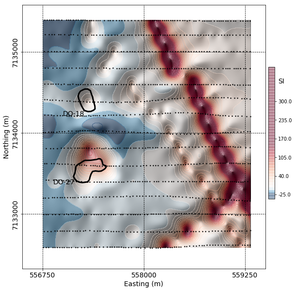

# Inversion using spatially variable mixed ℓp norms

_Dominique Fournier and Douglas W Oldenburg_

https://doi.org/10.1093/gji/ggz156



## Summary

Non-uniqueness in the geophysical inverse problem is well recognized and so too is the ability to obtain solutions with different character by altering the form of the regularization function. Of particular note is the use of ℓp norms with p ∈ [0, 2] which gives rise to sparse or smooth models. Most algorithms are designed to implement a single ℓp norm for the entire model domain. This is not adequate when the fundamental character of the model changes throughout the volume of interest. In such cases we require a generalized regularization function where each sub-volume of the model domain has penalties on smallness and roughness and its own suite of ℓp parameters.
Solving the inverse problem using mixed ℓp norms in the regularization (especially for p < 1) is computationally challenging. We use the Lawson formulation for the ℓp norm and solve the optimization problem with Iterative Reweighted Least Squares. The algorithm has two stages; we first solve the l2-norm problem and then we switch to the desired suite of ℓp norms; there is one value of p for each term in the objective function. To handle the large changes in numerical values of the regularization function when p values are changed, and to ensure that each component of the regularization is contributing to the final solution, we successively rescale the gradients
in our Gauss–Newton solution. An indicator function allows us to evaluate our success in finding a solution in which components of the objective function have been equally influential.
We use our algorithm to generate an ensemble of solutions with mixed ℓp norms. This illuminates some of the non uniqueness in the inverse problem and helps prevent overinterpretation that can occur by having only one solution. In addition, we use this ensemble to estimate the suite of p values that can be used in a final inversion. First, the most common features of our ensemble are extracted using principal component analysis and edge detection procedures; this provides a reference model. A correlation of each member of the ensemble with the reference model, carried out in a windowed domain, then yields a set of p values for each model cell. The efficacy of our technique is illustrated on a synthetic 2-D cross-well example. We then apply our technique to the field example that motivated this research, the 3-D inversion of magnetic data at a kimberlite site in Canada. Since the final regularization terms have different sets of p values in different regions of model space we are able to recover compact regions associated with the kimberlite intrusions, continuous linear features with sharp edges that are associated with dykes and a background that is relatively smooth. The result has a geologic character that would not have been achievable without the use of spatially variable mixed norms.

## Citation

Dominique Fournier, Douglas W Oldenburg, Inversion using spatially variable mixed ℓp norms, Geophysical Journal International, Volume 218, Issue 1, July 2019, Pages 268–282, https://doi.org/10.1093/gji/ggz156

```
@article{fournier_inversion_2019,
    author = {Fournier, Dominique and Oldenburg, Douglas W},
    title = "{Inversion using spatially variable mixed ℓp norms}",
    journal = {Geophysical Journal International},
    volume = {218},
    number = {1},
    pages = {268-282},
    year = {2019},
    month = {03},
    issn = {0956-540X},
    doi = {10.1093/gji/ggz156},
    url = {https://doi.org/10.1093/gji/ggz156},
}

```
